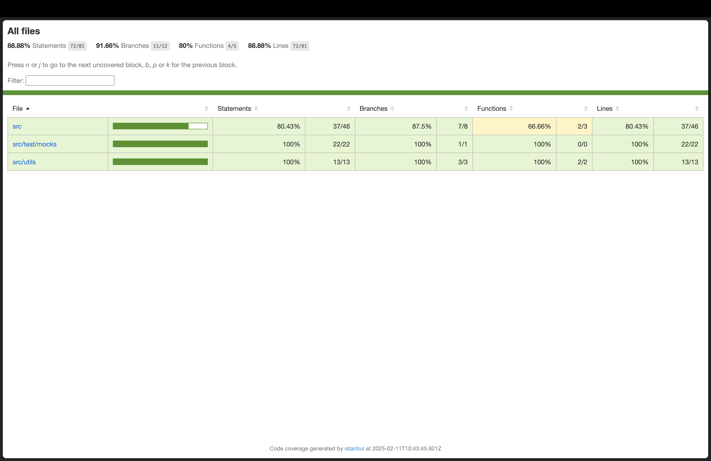

## VITEST



- to open this use

```js
//for mac
open coverage/index.html
```

- for mockapi we are using msw

- code coverage providers

  > the build in one is v8 but for more functionality istanbul is famous

  g
